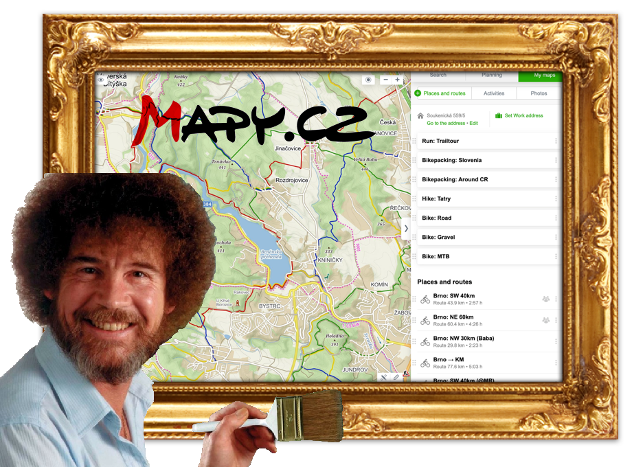

# Refined Mapy.cz

> Refines Mapy.cz interface and adds useful features

## Install

* [Chrome extension from Chrome Web Store](https://chrome.google.com/webstore/detail/ekolhceminigjalkpbbajnippfomegcc)
* Firefox add-on – TODO 👷‍
* Safari extension – probably not gonna happen, TBH

## Features

#### Condensed Map interface 🗺

Redundant controls hidden, the rest made more compact and unified. Hidden hefty text descriptions. Hidden paid Points of interest.

#### Condensed Sidebar interface 🧩

Reduced size of lot of elements to fit more content, especially saved routes.

#### Keyboard shortcuts 🕹

Keyboard shortcuts for fast map type switching (<kbd>Q</kbd> Basic, <kbd>W</kbd> Outdoor, <kbd>E</kbd> Aerial)

## Future Features 🧠💡🙈

* Keyboard shortcuts for zooming (relative & absolute)
* Shortcut to Street View (Panorama)
* When drag'n'dropping gpx routes, change colors
* Preview route on hover
* Zoom to fit

## Contribute

Feel free to! 🙏

1️⃣ `npm i`

2️⃣ `npm develop`

3️⃣ load unpacked extension from `./build` into Chrome

## Inspiration

* [refined-hacker-news](https://github.com/plibither8/refined-hacker-news)
* [refined-github](https://github.com/sindresorhus/refined-github)

