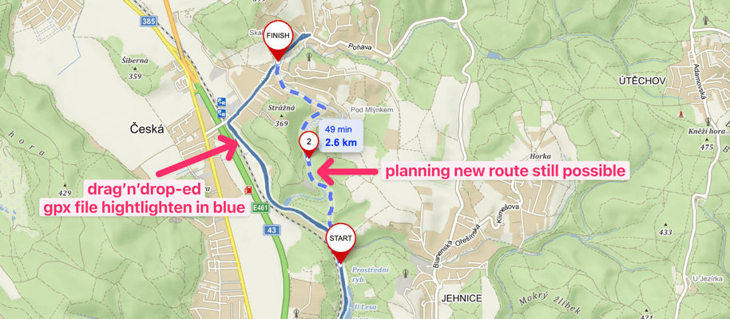
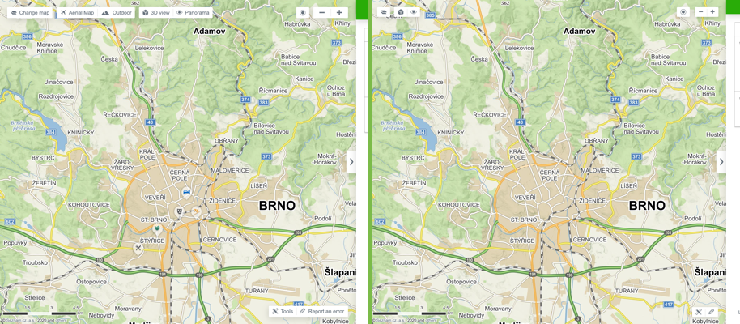
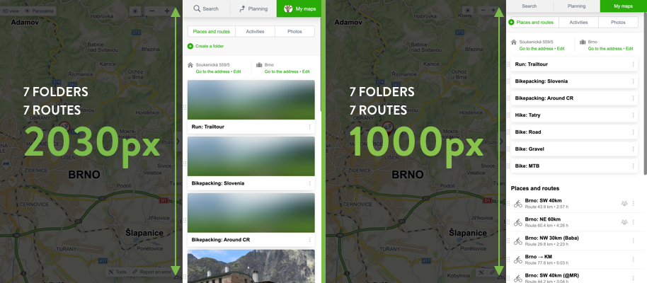
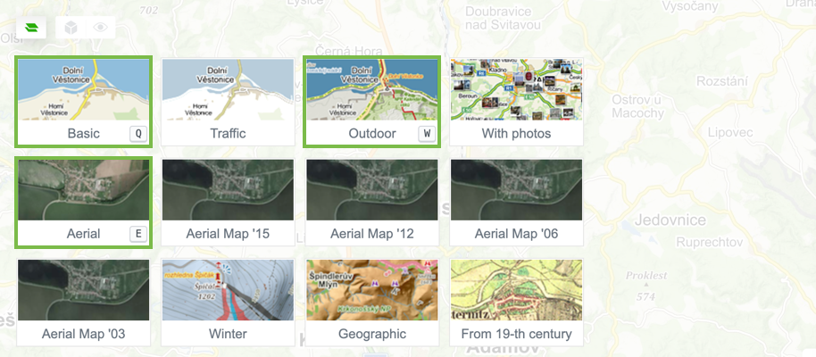

# Refined Mapy.cz

> Refines Mapy.cz interface and adds useful features

## Install

* [Chrome extension from Chrome Web Store](https://chrome.google.com/webstore/detail/ekolhceminigjalkpbbajnippfomegcc)
* Firefox add-on – TODO 👷‍
* Safari extension – probably not gonna happen, TBH
* [Userscript](https://cdn.jsdelivr.net/gh/strajk/refined-mapy.cz@master/greasemonkey.user.js)
* 

<a href="https://en.wikipedia.org/wiki/Bookmarklet">Bookmarklet</a>
<pre><code>
   javascript:{const s = document.createElement("script"); s.src = 'https://cdn.jsdelivr.net/gh/strajk/refined-mapy.cz@master/load.js'; s.type = 'text/javascript'; document.body.appendChild(s);};void(0);
   </code></pre>

## Features

#### Drop GPX file on a map to show as blue overlay 🖱

This will allow you to plan a new route while seeing the GPX overlay. Compared to the native GPX import which will get lost when you interact with planner

#### Condensed Map interface 🗺

Redundant controls hidden, the rest made more compact and unified. Hidden hefty text descriptions. Hidden paid Points of interest.

#### Condensed Sidebar interface 🧩

Reduced size of lot of elements to fit more content, especially saved routes.

#### Performance improvements ⚡️

Disabled some unnecessary slow animations, which were nice at first, but get annoying after a while.

#### Keyboard shortcuts 🕹

Keyboard shortcuts for fast map type switching (<kbd>Q</kbd> Basic, <kbd>W</kbd> Outdoor, <kbd>E</kbd> Aerial, <kbd>R</kbd> Geographic)

<kbd>P</kbd> toggle Pano, <kbd>O</kbd> toggle 3D

<kbd>1-9</kbd> set zoom levels

## Vylepšení (🇨🇿 version of Features)

#### Přetáhněte soubor GPX na mapu pro zobrazení `modrou` vrstvou 🖱

Umožní plánovat novou trasu zatímco vidíte GPX vrstvu. V porovnání s nativním importem GPX, který se ztratí, když interagujete s plánovačem

#### Zjednodušené rozhraní 🗺

Zbytečné ovládání skryto, zbytek zjednodušen a sjednocen. Skryty zbytečné textové popisky. Skryty placené body zájmu.

#### Zjednodušené rozhraní postranní lišty 🧩

Zmenšená velikost mnoha prvků pro zobrazení více obsahu, zejména uložených tras.

#### Zlepšení výkonu ⚡️

Vypnuto několik zbytečně pomalých animací, které byly původně pěkné, ale po chvíli jsou otravné.

#### Klávesové zkratky 🕹

Klávesové zkratky pro rychlé přepínání mapových podkladů (<kbd>Q</kbd> Základní, <kbd>W</kbd> Outdoor, <kbd>E</kbd> Letecká, <kbd>R</kbd> Geografická)

<kbd>P</kbd> přepnout Pano, <kbd>O</kbd> přepnout 3D

<kbd>1-9</kbd> nastavit úrovně přiblížení

## Future Features 🧠💡🙈

* Keyboard shortcuts for zooming (relative & absolute)
* Shortcut to Street View (Panorama)
* When drag'n'dropping gpx routes, change colors
* Preview route on hover
* Zoom to fit

## Contribute

Feel free to! 🙏

1️⃣ `npm i`

2️⃣ `npm develop`

3️⃣ load unpacked extension from `./build` into Chrome

## Inspiration

* [refined-hacker-news](https://github.com/plibither8/refined-hacker-news)
* [refined-github](https://github.com/sindresorhus/refined-github)
* [strava-map-switcher](https://github.com/liskin/strava-map-switcher)
  * Bookmarklet & Userscripts support

